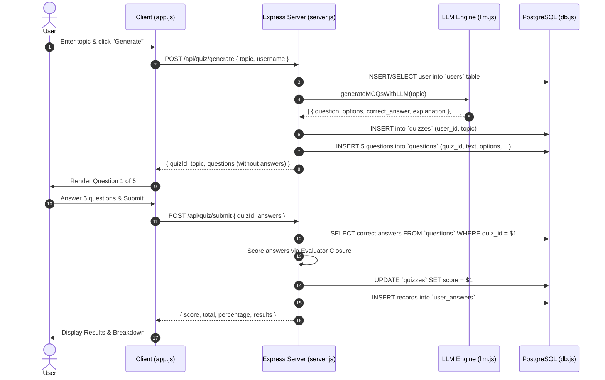

# High-Level Design (HLD)
## AI-Powered MCQ Quiz Generator

---

## 1. System Architecture

```mermaid
graph TD
    Client["Client Browser (Vanilla JS + HTML/CSS)"]
    Server["Express.js Application Server (Node.js)"]
    LLM["LLM Service (Google Gemini / OpenAI API)"]
    DB[("PostgreSQL Database")]
    Fallback["In-Memory Relational Engine (Fallback)"]

    Client -->|REST API Requests (async/await)| Server
    Server -->|Structured JSON Prompt| LLM
    LLM -->|5 Structured MCQs| Server
    Server -->|Connection Pool Queries (async/await)| DB
    Server -.->|If PostgreSQL Offline| Fallback
```

---

## 2. Component Architecture

### 2.1 Presentation Layer (Frontend Client)
- **Single Page Architecture**: Vanilla JavaScript, HTML5, and CSS3.
- **State Encapsulation**: Uses JavaScript closures (`createQuizController`) to isolate session state, selected choices, and timer counters.
- **Asynchronous Communication**: Uses `fetch` with `async`/`await` for API communication.

### 2.2 Application Layer (Express.js Server)
- **API Routing**: REST endpoints for quiz generation, submission, join querying, and leaderboard data.
- **Prompt Engineering & Structured Output Engine**: Builds strict JSON generation prompts and parses responses.
- **Scoring Engine**: Closure-based evaluation service (`createScoreEvaluator`).

### 2.3 Persistence Layer (PostgreSQL Database)
- **Connection Pool**: Uses `pg.Pool` for concurrent connection management.
- **Relational Tables**: `users`, `quizzes`, `questions`, and `user_answers`.
- **Integrity**: Enforced through Primary Keys (`SERIAL PRIMARY KEY`) and Foreign Keys (`REFERENCES ... ON DELETE CASCADE`).
- **Resilience Strategy**: Integrated fallback to an in-memory relational store if PostgreSQL is unreachable.

---

## 3. End-to-End Data Flow



---

## 4. API Endpoints

| Method | Endpoint | Description | Request Body | Response Body |
| :--- | :--- | :--- | :--- | :--- |
| `POST` | `/api/quiz/generate` | Generates 5 MCQs and saves them to DB | `{ topic, username, apiKey? }` | `{ success, quizId, topic, questions }` |
| `POST` | `/api/quiz/submit` | Submits answers, scores quiz, stores results | `{ quizId, answers }` | `{ success, quizId, evaluation }` |
| `GET` | `/api/quiz/:id/details` | Runs 3-table SQL JOIN for full quiz data | None | `{ success, sqlQuery, data: [...] }` |
| `GET` | `/api/leaderboard` | Runs SQL Aggregate JOIN for leaderboard | None | `{ success, sqlQuery, leaderboard: [...] }` |
| `GET` | `/api/status` | Reports DB connectivity and LLM telemetry | None | `{ postgresConnected, llmStats, nodeVersion }` |

---

## 5. Non-Functional & Security Design
- **Environment Isolation**: API keys and DB credentials loaded through environment variables.
- **Client Quiz Integrity**: Correct answers are omitted from the `/api/quiz/generate` payload and validated server-side during `/api/quiz/submit`.
- **SQL Injection Prevention**: Parameterized queries (`$1`, `$2`, ...) used for all SQL operations.
- **Referential Integrity**: Cascading deletes ensure orphan records are cleaned up automatically.
