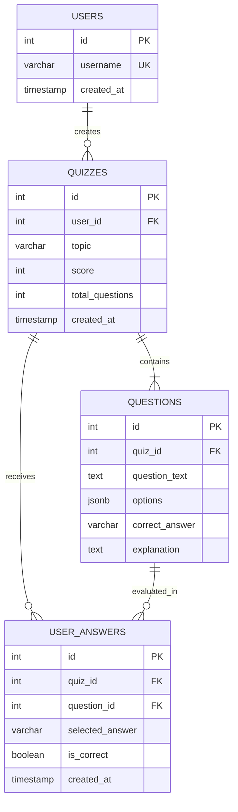

# Low-Level Design (LLD)
## AI-Powered MCQ Quiz Generator

---

## 1. Relational Database Schema & ER Diagram



---

## 2. Table Specifications & Constraints

### 2.1 Table: `users`
| Column | Type | Constraints | Description |
| :--- | :--- | :--- | :--- |
| `id` | `SERIAL` | `PRIMARY KEY` | Unique User Identifier |
| `username` | `VARCHAR(50)` | `UNIQUE NOT NULL` | Distinct username |
| `created_at` | `TIMESTAMP` | `DEFAULT CURRENT_TIMESTAMP` | Account creation timestamp |

### 2.2 Table: `quizzes`
| Column | Type | Constraints | Description |
| :--- | :--- | :--- | :--- |
| `id` | `SERIAL` | `PRIMARY KEY` | Unique Quiz Identifier |
| `user_id` | `INT` | `NOT NULL REFERENCES users(id) ON DELETE CASCADE` | Owner user ID (Foreign Key) |
| `topic` | `VARCHAR(100)` | `NOT NULL` | Quiz subject topic |
| `score` | `INT` | `DEFAULT 0` | Achieved score |
| `total_questions` | `INT` | `DEFAULT 5` | Total number of questions |
| `created_at` | `TIMESTAMP` | `DEFAULT CURRENT_TIMESTAMP` | Quiz generation timestamp |

### 2.3 Table: `questions`
| Column | Type | Constraints | Description |
| :--- | :--- | :--- | :--- |
| `id` | `SERIAL` | `PRIMARY KEY` | Unique Question Identifier |
| `quiz_id` | `INT` | `NOT NULL REFERENCES quizzes(id) ON DELETE CASCADE` | Parent Quiz ID (Foreign Key) |
| `question_text` | `TEXT` | `NOT NULL` | Question statement |
| `options` | `JSONB` | `NOT NULL` | Key-value options `{"A":"...","B":"..."}` |
| `correct_answer`| `VARCHAR(5)` | `NOT NULL` | Correct option key (`A`, `B`, `C`, or `D`) |
| `explanation` | `TEXT` | `NULL` | Justification for correct answer |

### 2.4 Table: `user_answers`
| Column | Type | Constraints | Description |
| :--- | :--- | :--- | :--- |
| `id` | `SERIAL` | `PRIMARY KEY` | Unique Answer Submission Identifier |
| `quiz_id` | `INT` | `NOT NULL REFERENCES quizzes(id) ON DELETE CASCADE` | Parent Quiz ID (Foreign Key) |
| `question_id` | `INT` | `NOT NULL REFERENCES questions(id) ON DELETE CASCADE` | Target Question ID (Foreign Key) |
| `selected_answer`| `VARCHAR(5)`| `NOT NULL` | Option selected by user |
| `is_correct` | `BOOLEAN` | `NOT NULL` | Evaluation outcome |
| `created_at` | `TIMESTAMP` | `DEFAULT CURRENT_TIMESTAMP` | Submission timestamp |

---

## 3. SQL Join Query Implementation

### 3.1 Multi-Table Inspection JOIN (4 Entities)
Combines `quizzes`, `users`, `questions`, and `user_answers` in a single query:
```sql
SELECT 
  q.id AS quiz_id,
  q.topic,
  q.score,
  q.total_questions,
  u.username,
  k.id AS question_id,
  k.question_text,
  k.options,
  k.correct_answer,
  k.explanation,
  a.selected_answer,
  a.is_correct
FROM quizzes q
INNER JOIN users u ON q.user_id = u.id
INNER JOIN questions k ON q.id = k.quiz_id
LEFT JOIN user_answers a ON k.id = a.question_id AND q.id = a.quiz_id
WHERE q.id = $1;
```

### 3.2 Aggregate Performance JOIN
Combines `users` and `quizzes` with aggregate functions and grouping:
```sql
SELECT 
  u.username,
  COUNT(q.id) AS total_quizzes_taken,
  COALESCE(SUM(q.score), 0) AS total_score,
  ROUND(AVG(q.score), 1) AS avg_score
FROM users u
LEFT JOIN quizzes q ON u.id = q.user_id
GROUP BY u.id, u.username
ORDER BY total_score DESC;
```

---

## 4. JavaScript Closure Specifications

### 4.1 Client-Side Quiz Session Closure: `createQuizController`
Encapsulates private state so external scripts cannot mutate quiz index or answers directly:

```
+----------------------------------------------------------------+
| Outer Function Scope: createQuizController(quizData)           |
|                                                                |
|  [Private Variables]                                           |
|   - quizId: number                                             |
|   - topic: string                                              |
|   - questions: Array<Question>                                 |
|   - currentIndex: number                                       |
|   - answers: Record<questionId, selectedKey>                   |
|   - timerId: intervalId                                        |
|   - secondsElapsed: number                                     |
|                                                                |
|  [Returned Public Interface (Closures)]                        |
|   - getCurrentQuestion()                                       |
|   - selectAnswer(optionKey)                                    |
|   - nextQuestion() / prevQuestion()                            |
|   - startTimer(callback) / stopTimer()                         |
|   - getAnswersPayload()                                        |
+----------------------------------------------------------------+
```

### 4.2 Server-Side Score Evaluator Closure: `createScoreEvaluator`
Maintains internal telemetry across evaluation requests:
```javascript
function createScoreEvaluator() {
  let processedCount = 0;

  return function evaluate(questions, userAnswers) {
    processedCount++;
    let score = 0;
    const results = questions.map(q => {
      const selected = userAnswers[q.id];
      const isCorrect = selected === q.correct_answer;
      if (isCorrect) score++;
      return {
        questionId: q.id,
        question: q.question_text,
        selectedAnswer: selected || 'None',
        correctAnswer: q.correct_answer,
        isCorrect,
        explanation: q.explanation
      };
    });

    return {
      score,
      total: questions.length,
      percentage: Math.round((score / questions.length) * 100),
      evaluationId: `EV-${processedCount}`,
      results
    };
  };
}
```

---

## 5. Structured Output LLM Schema

The prompt enforces strict JSON output without conversational text or backticks:

```json
[
  {
    "question": "string (clear question statement)",
    "options": {
      "A": "string (option 1)",
      "B": "string (option 2)",
      "C": "string (option 3)",
      "D": "string (option 4)"
    },
    "correct_answer": "string (A | B | C | D)",
    "explanation": "string (reason for correctness)"
  }
]
```

---

## 6. Asynchronous Request Flow & Error Handling

```
API Request ---> Async Handler ---> Try {
                                       await DB Query
                                       await LLM Generation
                                       await Transaction / Insert
                                       res.json(...)
                                     } Catch (err) {
                                       res.status(500).json({ error, details })
                                     }
```
- Handlers catch network or database errors and return standardized JSON error responses.
- Client catches rejected promises and alerts the user without breaking application state.
